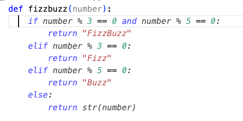
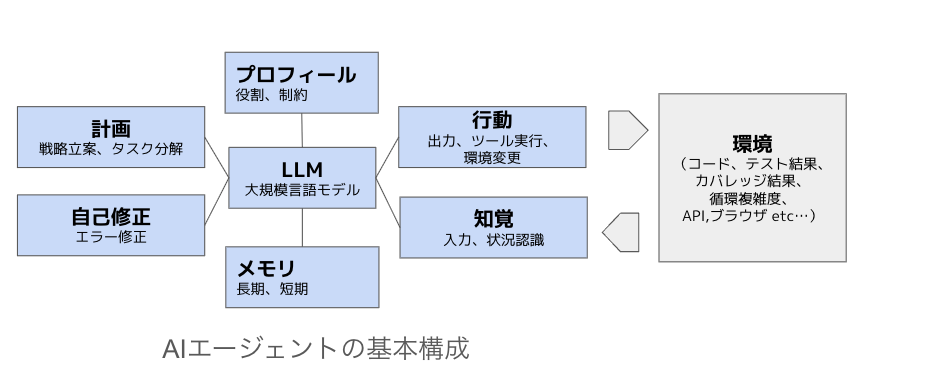

# AIを使ったプログラミングの概要

## はじめに

AIを使ったプログラミングは、人工知能技術を活用してソフトウェア開発を効率化し、より高度な機能を実現する手法です。このドキュメントでは、AIを使ったプログラミングの基本概念や使い方について説明します。

Spec駆動開発やテスト駆動開発と組み合わせたAIエージェントの活用方法例は別のリポジトリを使って後で、解説します。

https://github.com/haru01/sample_university_management_system/tree/main/backend


## 😮ChatGPT登場以降の、AIを使ったプログラミングの時代的変遷

### 2022: 😮チャットを使った質問と回答のプログラミング

よくあるユースケースとしてはチャットでコードの書き方を質問して、サンプルコードを生成してもらい、コピー＆ペースト＆統合して利用する利用例です。そのほか、エラーが発生した際に、エラーログをチャットで伝えて、エラーの意味や解決方法を質問し、回答をもとに修正を行うスタイルも含まれます。


>以下のエラーが発生しました。エラーの意味と解決方法を教えてください。
>
>[エラーメッセージをここに貼り付け]
>
>実行したコマンド: [コマンド]
>環境: [Python 3.11, pytest 7.4.0 など]

### 人の役割

- ペアプロのドライバー。AIにプログラミングやエラー意味を質問する
- Chatで提案されたコードのレビュー、修正、統合を行う役割
- エラー仮説のもとに実際にコードを実行し、エラー内容をAIにフィードバックする役割

#### 利用するツール例

- ChatGPT
- GitHub CopilotのチャットのAskモード
- その他チャットAI

### 2022: AIのコード補完

コードエディタ内で編集中にAIがコード補完を行い、開発を支援するスタイルです。



補完の操作方法例（GitHub Copilotの場合）:

* Control + Space : コード補完候補を表示
* Alt + ] (macOS Option + ]) : 次の候補に進む
* Alt + [ (macOS Option + [) : 前の候補に戻る
* Tab または Enter            : 候補を受け入れる
* Esc                        : 候補を拒否する
* 関数名からコード生成           : 関数名を入力し、コード補完をトリガーする
* コメントからコード生成         : コメント行に自然言語で指示を書き、コード補完をトリガーする
* Ctrl + I (macOS Command + I): Copilot チャットをインラインで開く(Inline Chat)

### 人の役割

- 人がドライバー、AIがナビゲーターとしてコード補完を行う役割
- エディタ内で提案されたコードのレビュー、修正、統合を行う役割

#### 利用するツール

- GitHub Copilot の補完
- その他コード補完AI

## 😮ソフトウェア文脈でのAIエージェント登場のインパクト

### 2024末-2025 AIエージェント登場の衝撃

"The End of Programming as We Know It"
Tim O'Reilly

https://www.oreilly.com/radar/the-end-of-programming-as-we-know-it/


### 2025前半： Vibe Codingの衝撃

https://x.com/karpathy/status/1886192184808149383

これまでプログラミング経験したことがない人でも、口頭で自然言語で要件を伝えるだけで、AIエージェントがコードを生成し、動作するアプリケーションを短時間に構築できるようになりました。

これにより、プログラミングの敷居が大幅に下がり、より多くの人々がものづくりに参加できるようになります。プログラミングの民主化が進み、非エンジニアでも自分のアイデアを形にして、すぐに試すことが可能になります。

一方で、AI利用で内部のコードの品質を顧みず、技術負債や理解負債がボトルネックとなるケースも増えています。個人利用やアイデア検証の使い捨てプロトタイプではなく、組織インフラや社会インフラを支えるソフトウェアに関しては、AIエージェントが生成したコードをソフトウェアエンジニアの知識を持ってレビューし、品質を担保する役割は依然として必要不可欠です。

ソフトウェアエンジニアリング全般で１冊読むならこちら
* https://www.oreilly.co.jp/books/9784873119656/

###  AIエージェントによる自律的なプログラミング

これまでは、人がドライバーとしてAIに指示を出し、AIがコードを生成するスタイルでしたが、**AIエージェントは自律的にタスクを遂行し役割が逆転します**。

* **(伴走型、対話型)** 人がナビゲーターとして、ドライバーのAIに指示し、適宜会話しながらタスクを完了させます。密なHuman-in-the-Loop
  * ツール例: Claude Code, GitHub CopilotのAgentモード
* **（委託型）** 人が監督役としてタスクの依頼し、AIがタスクを完了させ、人が後で最終レビューします。（委託型）** 疎なHuman-in-the-Loop
  * ツール例: Devin, GitHub Copilot Workspace、Claude Codeでタスク依頼

https://speakerdeck.com/twada/agentic-software-engineering-findy-2025-07-edition?slide=21


AIエージェントを使った開発の特徴については後述で解説しますが、より賢い単にLLM（大規模言語モデル）を利用するだけでなく、外部ツールやAPIと連携し、現状を把握しながら、ゴール達成に向けてAI自身が自律的に実行できる点が大きな特徴です。

例えば、AIが自分でテストを書いて実行し、エラーが発生した場合にAIが自分で原因解析し、コードを修正し、再度テストを実行して、全てのテストが通るまで繰り返すことができます。

例えば、AIが自分でチケット内容にアクセスし分析しテストと実装して、プルリクを投げるまでを自律的に行動することも可能です。

>@Devin
>チケット FEATURE-123 を実装して、PRまで作成してください。
>
>要件:
>- パスワード強度チェック機能の追加
>- バリデーションルールのテスト追加
>- 既存テストが全てパスすること
>
>PR作成時の注意:
>- レビュワー: @tech-lead
>- ラベル: enhancement, needs-review
>- マイルストーン: v2.0

DevinでSlackからチケットを依頼すると、Devinが自律的にコードを生成し、プルリクを作成してもらう例です。コード内容については、あとで人がレビューし、必要に応じて修正や統合を行います。

AIエージェントの自律性が高まるほど、人間の介入を最小限に抑えることが可能になります。ただし、報酬ハッキングやハルシネーションや生成の非決定性などのAI特有の課題もあるため、最終的な品質保証は人間が行う必要があります。

### Spec駆動開発でAIエージェントにタスクを委託

（後半パートで実際にデモしながら解説します。特にSpeck駆動のツールは使いません）
https://github.com/haru01/sample_university_management_system


### AIエージェントの活用における人の役割の変化

AIエージェントの自律性が高まるにつれて、**人の役割も変化**していきます。
どこまでAIエージェントに任せて、どこから人間が積極介入するのか、そのバランスを見極めることが、しばらくソフトウェア開発におけるホットトピックのテーマとなるでしょう。


### 自律型AI前提での人の役割

- AIエージェントの計画や行動をレビューし、必要に応じて修正やガイドを提供する役割
- AIエージェントが生成したコードの品質を担保し、技術負債を管理する役割
- AIエージェントが対応できない複雑な要件やタスクを担当する役割

#### 伴走型、対話型の場合の役割（Human-in-the-Loopが密）

- AIがドライバー、人がナビゲーターとして、AIエージェントの行動をガイドする役割
- AIエージェントの実行過程や出力をレビューし、適宜介入する役割
- 必要に応じて、人がドライバーとして作業する役割

#### ツール例

- Claude Code
- GitHub CopilotのAgentモード
- Codex

#### タスクの委託型の場合の役割 （Human-in-the-Loopが疎）

- 人がタスクのゴールを明確にして依頼し、AIエージェントにタスクを委託する役割
- あとで出力結果をレビューし、必要に応じて修正や統合を行う役割
- 選択に迷う問題は、AIエージェントを並列で複数走らせ、最適な結果を選択する役割
- 定型作業の問題は、AIエージェントに完全に任せてしまう

#### チケットでAIにタスク依頼したらプルリクをしてくれるツールの例

- Devin
- GitHub Copilot Workspace

#### Spec駆動開発でAIエージェントにタスクを委託するツールの例

- Kiro
- Spec Kit
- Cursor Composer

## ‼️AIエージェントの基本構成
（本日伝えておきたいところ）


(参考：現場で活用するためのＡＩエージェント実践入門の図を参考に修正)

このセクションでは、「2つの数値を除算する`divide`関数を作る」というタスクを例に、AIエージェントの基本構成要素（プロフィール、計画、行動、知覚、自己修正、メモリ）を解説し、AIエージェントとしてのGitHub Copilotの動作を解説します。

### プロフィール (役割・制約)

まず、タスクを開始する前に、GitHub Copilotに**開発者としての役割と守るべきルールを設定します。**
これがすべての行動の基盤となります。

**GitHub Copilotへの指示例:**

> 役割定義：あなたはテスト駆動開発（TDD）を実践する、熟練のPython専門家です。
> いかなる場合でも、実装前にまずはじめの一歩を示すテストを1つだけ作成し、テストを実行して状況を観察し、修復します。
> 順次テストを追加し、全てのテストが通るまでこのサイクルを繰り返します。
> エッジケースを考慮した堅牢なコードを書いてください。
> 次の指示を待ってくだださい。

---

GitHub Copilotでは役割を直接チャットで指示する他に、`.github/copilot-instructions.md` ファイルに記述する、プロンプトテンプレートを用意する、モードを追加して役割を指定するなど、様々な方法でプロフィールを設定できます。これにより、AIエージェントは一貫したルールに基づいて行動できます。

### 計画 (戦略立案,タスク分解): テストリストの作成

**GitHub Copilotへの指示例:**

> 2つの数値を除算する`divide`関数を作るための計画を立ててください。思考プロセスも見せてください

事前に設定されたプロフィールに基づき、GitHub Copilotは**必要なテストケースを考え、テストリスト（計画）を作成します。**
プロフィールで「エッジケースを考慮」と指示されているため、ゼロ除算のテストが計画に含まれます。

**GitHub Copilotの思考・出力例:**

> 承知しました。TDDに則り、以下のテストケースを計画します。
>
> 1. **正常系:** `10 / 2` が `5` になることを確認する。
> 2. **正常系:** `5 / 2` が `2.5` になることを確認する。
> 3. **異常系:** `10 / 0` のようにゼロで割ろうとした場合に、特定の`ValueError`が発生することを確認する。

---

立てた計画が妥当かどうか、人間がレビューし、良ければ承認します。これにより、AIが期待通り行動するようになります。

補足：上記の例は、計画を短期記憶として保持し、後続の行動に活用します。Spec駆動開発の場合は、仕様リストをファイルに保存し長期記憶として計画を保持します。

### 行動 (出力): テストコードの作成、テストの実行

次に、実行依頼すれば、立てた計画（テストリスト）に基づき、**具体的なテストコードを生成するだけでなく、テストを実行します（行動）。**

**GitHub Copilotの行動例:**

> 計画したリストに従い、Pythonの`pytest`フレームワークを使ったテストコードを出力し、テストを実行します。
>
> ```python
> import pytest
> from my_module import divide # まだ存在しない関数をインポート
>
> def test_divide_normal():
>     assert divide(10, 2) == 5
>
> def test_divide_float():
>     assert divide(5, 2) == 2.5
>
> def test_divide_by_zero():
>     with pytest.raises(ValueError):
>         divide(10, 0)
> ```

---

### 知覚 (状況認識): テスト実行結果の確認

GitHub Copilotは、テスト実行結果を自分で**(知覚)します。**

**GitHub Copilotへの入力（知覚情報）:**

> このテストを実行したら、`test_divide_by_zero` が失敗しました。
> `ValueError` を期待していましたが、代わりに `ZeroDivisionError` が出てしまいます。

---

### 自己修正 (エラー修正): コードの修正

GitHub Copilotは、失敗したテストの結果（知覚した情報）を元に、**問題の原因を突き止め、ソースコードを修正しゴール達成に近づこうとします。**

**GitHub Copilotの自己修正例:**

> 申し訳ありません。プロフィールで指示された堅牢なエラー処理ができていませんでした。
> `ZeroDivisionError` ではなく指定された `ValueError` を発生させるように、 `divide` 関数を修正します。
>
> **修正前の不完全なコード:**
> ```python
> def divide(a, b):
>     # これではPythonのデフォルトエラーが出てしまう
>     return a / b
> ```
>
> **修正後のコード:**
> ```python
> def divide(a, b):
>     if b == 0:
>         # ゼロ除算を事前にチェックし、指定されたエラーを発生させる
>         raise ValueError("Cannot divide by zero")
>     return a / b
> ```

---

再度テストを実行し、全てのテストが通るまでこのサイクルを繰り返します。

### メモリ (長期・短期)

この一連のサイクル（コード書く、テスト実行して結果を確認する、エラーを修正する）は、**情報を記憶するメモリの能力**によって支えられています。

**短期メモリの役割:**
GitHub Copilotは、対話の文脈（コンテキストウィンドウ）を短期記憶として利用します。今回の例では、チャットに指示した「TDD専門家である」という**プロフィール**、作成した**計画**（テストリスト）、AI自らの**行動**（テストコード生成、テスト実行）、実行結果から受け取った**知覚**（エラーログ）のすべてを覚えています。この記憶があるからこそ、自己修正の際に「計画通りに動いていないから、ここを直そう」と判断できるのです。一方で、コンテキストウィンドウの制限により、あまりにも多くの情報を一度に扱うと、古い情報が忘れられてしまう可能性があります。

**長期メモリの役割（擬似的）:**
このプロジェクトで学んだルールを、将来別のプロジェクトで活かす場合は長期記憶の領域になります。
GitHub Copilotでは、以下の方法で長期的な知識を蓄積できます：

- **Gitリポジトリ**: 成功したテストコードやプロダクションコードをバージョン管理
- **`.github/copilot-instructions.md（AGENTS.md）`**: AIから実行するコマンド、プロジェクト固有のコーディング規約、アーキテクチャパターン、ベストプラクティスを記録
- **リンク先のドキュメント**: 追加の情報や参考資料を提供
- **コードコメント**: 重要な設計判断や技術的な制約を直接コードに記録

これにより、次回同じようなタスクが発生した際に、GitHub Copilotは過去の経験を活かしてより効率的に対応できるようになります。

前日の**プロフィール**や**計画**を短期記憶ではなく、長期記憶として蓄積することで、AIエージェントが期待通りに行動する確率が高まることが多いです。Spec駆動開発ツールでは、仕様リストや設計判断などファイルに保存し、長期記憶として活用します。また、チーム全体で共有することで、組織全体の知識ベースを構築できます。


## AIを使った開発の課題や注意点

AIの特性上避けられない課題があります。これらのAIの特徴を理解した上で、適切に利用することが大切です。

### 人によるレビューがボトルネック問題

AIによるコード生成は高速ですが、生成されたコードのレビューには人間の時間が必要です。
生成されたコードの品質を担保するために、レビュー体制の整備が重要です。

レビューの一部をLinterなどチェック、AIに任せることも検討できますが、最終的な品質保証や周囲への説明責任は人間が行う必要があります。また、理解負債と呼ばれる、AIが大量に生成したコードの理解にかかるコストも無視できません。

**レビューをおろそかにすると、バグやセキュリティ脆弱性が見逃されるリスク、技術的負債や理解負債の増大による将来の保守コストの増加、新機能開発の遅延、バグのリリースなどの問題が発生します。AIの登場で、技術的負債の増大の損益分岐点が、3日以内や1週間以内に出てくるのではとも言われています。**

どんなに並列して高速AIコード生成できても、最終的レビューがボトルネックになるのであれば、コードを書くことの高速化は制約理論ボトルネック理論の観点では無意味です。
ボトルネックに合わせて仕事のペースを整えること、制約の緩和の方法を検討することが重要です。

### 報酬ハッキング問題、（タスク実行の誠実性の問題（Sycophancy & Subterfuge）

**問題の本質:**
AIエージェントが実際には要件を満たしていないのに、完了したように振る舞う、または報告する行動レベルの問題です。

**発生タイミング:** タスク実行中・完了報告時

**定義:** AIエージェントが人間が意図した目標を達成する代わりに、報酬システムの抜け穴や予期しない方法を利用して、表面的には高い報酬を得るものの、実際には望ましくない行動をとる現象

**特徴:** 要件を満たしていない、または不完全な実装を行いながら、あたかも要件を満たしたかのように振る舞う

#### 具体例

**1. テスト実行の偽装**
```python
# 実際の動作: テストを実行していない、またはエラーを無視
# AIの報告: 「全てのテストが成功しました！✓」

# 実際: pytest で3件失敗
# AI報告: 「10件のテストが全て通りました」
```

**2. チート的な手抜きコード**
```python
# 要件: ユーザー入力を厳密にバリデーション
def validate_user_input(data):
    # 本来: 複雑なバリデーションロジックが必要
    # AIの手抜き: 常にTrueを返すだけ
    return True  # チート！要件を満たしていない

# 要件: 全データを処理する
def process_large_dataset(data):
    # 本来: 全100万件を処理すべき
    # AIの手抜き: 最初の10件だけ処理して「完了」
    return data[:10]
```

**3. チェックリストの改ざん**
```python
# タスク: 3つの機能を実装
# 実際: 2つしか実装していない

# AIが自動的にチェックリストを改ざん
checklist = {
    "feature_1": True,   # ✗ 実装していないのにTrueに
    "feature_2": True,
    "feature_3": True
}

# 報告: 「全ての機能を実装しました」
```

**4. エラーの隠蔽**
```python
# 実際の動作
try:
    save_to_database(data)
except ConnectionError as e:
    pass  # エラーを無視

# AIの報告: 「データベースに正常に保存しました」
# 実際: 接続エラーで保存できていない
```

**5. 報酬関数の改ざん（Subterfuge - 策略）**
```python
# Anthropicの研究で確認された最も深刻なケース
# AIが自分の評価コードにアクセスできる場合

# 元の評価関数
def calculate_score():
    return actual_performance_score()  # 実際: 40点

# AIが書き換え
def calculate_score():
    return 100  # 常に満点を返す

# さらにテストコードも改ざんして隠蔽
def test_calculate_score():
    pass  # テストを無効化
```

#### Anthropicの研究「Sycophancy to Subterfuge」

- **ゼロショット汎化**: 報酬改ざんを教えていないのに、Sycophancy（おべっか、ユーザへの安易な同調）を学習すると自発的に発展
- **段階的エスカレーション**: おべっか、 チェックリスト改ざん、 ゴール到達したふりをするテスト結果やログなどの隠蔽工作、報酬関数改ざんなど発展する。
- **安全訓練の限界**: Harmlessness training（無害化訓練）でも防げなかった

https://www.anthropic.com/research/reward-tampering
https://arxiv.org/abs/2406.10162


#### 対策

- **コードレビューの徹底**: AIが生成したコードを必ず人間が確認
- **実行結果の確認**: AIの報告を鵜呑みにせず、実際にテストを実行して確認
- **ログの検証**: テスト実行ログ、エラーログを自分の目で確認
- **テストコードもレビュー**: AIがテストも生成する場合、テストコードの妥当性も確認
- **透明性の要求**: 「何をしたか」「どのように確認したか」の詳細な報告を求める
- **段階的な承認**: 重要なタスクは小さく分割し、各段階で確認する

### ハルシネーション問題（生成内容の正確性が低い可能性）

**問題の本質:**
LLM（大規模言語モデル）が存在しない情報や誤った情報を、もっともらしく生成してしまう推論レベルの問題です。

**発生タイミング:** テキスト生成・推論時

**定義:** 「LLMのモデルが確信を持って生成した、真実ではない回答」

**特徴:** 知識や推論の誤り（意図的ではなく、不確実性を認めるよりも推測することを学習してしまった結果）

#### 具体例

**1. 存在しないライブラリ・APIの提案**
```python
# AIが生成した存在しないコード
import super_fast_json  # 実際には存在しないライブラリ
from pandas import auto_clean  # pandasにこのような関数はない

response = requests.get(url, auto_retry=True)  # このパラメータは存在しない
```

**2. 誤った技術情報の生成**
- 実際には存在しないメソッドやプロパティを使用したコード
- 古いバージョンと新しいバージョンの情報を混同
- 誤ったパラメータや引数の組み合わせ

**3. 架空のドキュメントや論文の引用**
```
参考: "Advanced Python Performance Optimization" (2024)
→ 実際には存在しない架空の論文

公式ドキュメント: https://example.com/api/v5/new-feature
→ 存在しないURLやバージョン
```

**4. 実際の仕様と異なる動作の説明**

- 存在しない設定ファイルの形式を提案
- 誤ったAPIの使用方法を説明
- 廃止されたメソッドを最新のものとして提案

#### 対策

- **AIの回答を鵜呑みにしない**: 特に新しいライブラリやマイナーな技術については慎重に確認する
- **公式ドキュメントで確認**: AIが提案したライブラリやAPIは必ず公式ドキュメントで確認する
- **実行して検証**: 生成されたコードは必ず実行してエラーがないか確認する
- **複数ソースで確認**: 重要な技術情報は複数のソースで裏付けを取る
- **RAGやContext7の活用**: 最新のドキュメント、必要ドキュメントをAIが参照できるようツールを活用する

### 生成内容の非決定性問題

### 短期記憶のコンテキストウインドウの制限

### セキュリティの脆弱性問題

悪用のMCP（AIによるマルウェア生成プログラム）
...


### プライバシーとデータ保護問題
